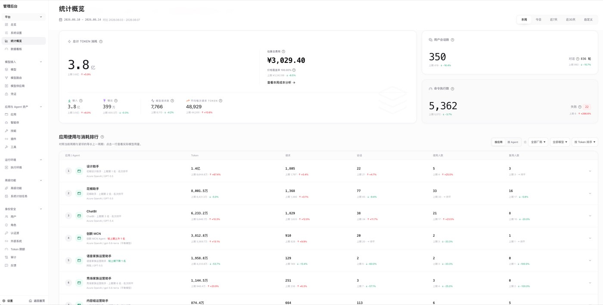

# Sandbox as an Option, Not a Default: Huajiao's Agent Platform Architecture and Cube Practice

By｜Head of Infrastructure, Huajiao Live · Wang Chenglong; CTO, Huajiao Live · Feng Bingqing

**Editor's note:** Most teams adopt an Agent sandbox thinking "we need isolation, so let's add a sandbox." The Huajiao team worked in a different order: they first designed the Agent platform as a configurable execution-environment abstraction, where the sandbox is just one option in that abstraction layer — each Agent decides whether to use it based on its own isolation needs.

This practice record covers how that thinking landed: from organization-level isolation decisions, to contributing the Go SDK, locating and fixing a snapshot-restore bug in host-mount scenarios, and redefining a terminal protocol on top of CubeSandbox.

## 1. The Sandbox Is One Option Among Execution Environments

Huajiao Live is a product of Huafang Group. Our enterprise Agent platform first completed its 0-to-1 validation on the Huajiao Live business side; subsequently, building on the accumulated underlying capabilities, we set up an independently deployed instance for the Huafang Group middle platform.

- Huajiao Agent mainly serves Huajiao Live's internal design, product, engineering, operations, customer service, and moderation departments. The app center currently has 25 entries online, including the DMG business assistant, ChatBI, content operations assistant, design assistant, product assistant, H5 page generation assistant, customer service assistant, moderation data analysis assistant, business intelligence platform, and telesales platform — plus a standalone consumer-facing product.
- Huafang Agent serves the Huafang Group middle platform and has landed in 5 departments — economic systems, data, administration, legal, and GR (government relations) — including the BI data assistant, administration assistant, legal workbench, and GR workbench.

The two deployments are based on the same Agent Runtime, serving Huajiao Live's business departments and Huafang Group's middle-platform departments respectively, with about 30 different Agent applications landed in total. Huajiao's practice completed the 0-to-1 validation of the platform and business applications; Huafang's practice further proved that the same underlying capabilities can be independently deployed and reused across organizations.

*Figure 1: Huajiao Agent and Huafang Agent platform screenshots*

When building the Agent platform, we first drew a boundary: no business-related code goes inside the platform. All Agent capabilities are generated through backend configuration. This way, one architecture can be fully reused for Agents in any scenario, without redeveloping and "reinventing the wheel" for each new business. The analogy: the Agent platform is the operating system, Agents are the applications running on it, and Skills are the various development frameworks and SDKs.

The most critical abstraction in this architecture is the execution environment — when the LLM wants to execute a command, where exactly it executes is the question the execution environment answers. One Agent can be configured with one or more execution environments, and dynamic registration and removal of personal private execution environments is also supported. An execution environment's OS can be Windows, Linux, or macOS; its deployment form can be bare metal, ordinary cloud servers, or Kubernetes. Every execution environment starts a daemon responsible for communicating with the Agent platform. **CubeSandbox is one sandbox option we integrated into the execution-environment service; it is currently deployed only on ordinary cloud servers, with K8s scenarios to follow.** Whatever the nature of the execution environment itself, a sandbox can optionally be used on top of it.

We set no uniform rule for when a sandbox is warranted — we judge by the Agent's positioning. The core question is just one: do the resources on this execution environment need to be physically isolated among multiple users? If the Agent manages a dedicated machine whose work output is consumed by a single party, using a sandbox or not makes no difference; once the same execution environment serves multiple users and everyone's working state must be independent of each other, we generally choose the sandbox. In other words, the isolation decision is not made uniformly at the platform layer — it lands on the concrete execution environment along with the Agent's positioning.

Between Agents, we decide whether to use a sandbox by the standard of "do resources need physical separation"; between organizations, we applied the same standard at a higher level. For example, Huajiao Agent and Huafang Agent use two completely independent instance deployments — platform services, account permissions, business data, application assets, execution environments, and CubeSandbox instances are managed separately, with no shared control plane. That's because at this stage we value clear, auditable security boundaries between different organizations more than the resource-reuse efficiency a shared control plane would bring.

## 2. Selecting and Landing Cube Sandbox

Before selection, we used the most primitive approach: directory isolation on a single server. It brought a series of problems: no isolation capability — user A could theoretically operate on user B's files through the Agent. We evaluated several other categories of options and rejected them one by one: Docker was slow to start, incompletely isolated, and low-performing; traditional VMs were costly and inflexible in resource allocation. Among MicroVM-level options, after researching and benchmarking startup speeds, we found CubeSandbox the fastest, with features and performance meeting expectations — strong isolation in particular was experimentally confirmed to meet our needs — so we adopted it.

After selection was settled, the first practical problem was: where does user data live? Sandboxes themselves are reclaimable, but users' working state must be preserved across sandboxes. Our initial approach was mounting external disks: user data needs persistence and must not be lost to cloud server failures, so it went on a data disk rather than the system disk. Later, considering high availability, we found that ordinary data disks cannot be attached to multiple cloud servers simultaneously, so we upgraded to an NFS solution — all persistent user data is written to an NFS directory; when a cloud server fails, a new machine immediately starts up, mounts the same NFS, and continues serving, losing only the in-flight processes. This solution integrates with CubeSandbox via the host-mount mechanism: the execution-environment daemon deployed on cloud servers maps different directories into the sandbox; no privilege escape is possible from inside the sandbox, and the daemon only concerns itself with the smallest granularity — one session maps to one sandbox.

During landing, what we encountered was not only application-layer questions of "how to use CubeSandbox," but also several occasions where we had to touch CubeSandbox's own code directly. We have been using CubeSandbox since its very first release version. Back then there was no official Go SDK, so we wrote one ourselves, aligned with the Python SDK's capabilities, and submitted it to the official repository ([PR #254](https://github.com/TencentCloud/CubeSandbox/pull/254)) "Add Go SDK" — a single submission with complete capabilities including lifecycle management, command execution, file reading, and proxy transport, totaling 15 files and 3,288 new lines of code. On the day it merged, official code review found that `Sandbox.Close()` would accidentally close the HTTP connection pool shared by multiple sandboxes, and we promptly submitted ([PR #322](https://github.com/TencentCloud/CubeSandbox/pull/322)) to fix it.

Another, deeper problem appeared in the hibernate/wake scenario. Sandboxes with mounted disks had a bug during pause and resume; we traced the root cause to CubeSandbox not preparing the migration metadata virtio-fs needs when snapshotting host-mount scenarios — the root inode therefore lost its migration state, and restore failed with InvalidVirtioFsState. We subsequently submitted ([PR #341](https://github.com/TencentCloud/CubeSandbox/pull/341)) and ([PR #354](https://github.com/TencentCloud/CubeSandbox/pull/354)) for the fix and follow-up hardening, but closed PR #354 ourselves after testing, because we weren't sure the change was perfect. Our current practice is to destroy the sandbox and rebuild it directly, bypassing the parts not yet resolved.

*Figure 2: Huafang Group Agent platform management console*

CubeSandbox has now been running in our production environment for over 3 months, supporting about 30 Agent applications across the Huajiao and Huafang instances, with daily token consumption of about 83 million.

## 3. agentd: Redefining a Terminal Protocol on Top of CubeSandbox

To enrich the capabilities we expose externally, we added a self-developed terminal protocol layer on top of Cube Sandbox — agentd — which interfaces with the Agent platform's execution-environment service and coexists with the envd bundled in Cube templates, each with its own division of labor. It starts by default when the sandbox template is built.

### 3.1 agentd's Positioning and Why We Built It

envd itself doesn't lack basic capabilities like command execution, file read/write, or PTY. CubeSandbox's official documentation defines it as the Sandbox's native data plane: template probes and initialization, as well as the SDK's command/file APIs, all depend on it; command, file, filesystem, and PTY-related requests are routed to envd's port 49983.

But the agentd we developed is not a simple gap-filler for envd — it is a **dedicated terminal-session data plane whose semantics the platform defines and owns** for exec_command / write_stdin.

**We built agentd for three reasons.** First, we needed a terminal protocol we define ourselves and can evolve independently over the long term, rather than binding the runtime's session model directly to the external API semantics of Cube or E2B. Second, we needed an interface (StatFiles) that could directly verify "whether mounted skills and artifacts are actually visible inside the Sandbox," plus a bearer-token authentication boundary under our own control. Third, early in implementation we hit a concrete defect — the Cube API didn't pass the environment variables set at Sandbox creation through to CubeMaster, which broke our original plan of injecting a random AGENTD_TOKEN into each Sandbox; we later switched to a fixed token shared between the template and the Worker. More precisely: what agentd fills in is the contract, controllability, and failure semantics we ourselves need — not the general-purpose execution capabilities envd might be missing.

| Dimension | envd | agentd |
|:--|:--|:--|
| Port | 49983 | 49984 |
| Ownership | CubeSandbox native component | Service inside this repo's templates |
| Cube template/init | Required | Not responsible |
| Cube native SDK command/file APIs | Used | Not used |
| This platform's exec_command / write_stdin | Not routed through it currently | The sole execution data plane currently |
| Lifecycle operations | Not responsible | Not responsible |
| Sandbox create/pause/resume/destroy | Handled by Cube API / Cube SDK — neither is at that layer | Same |

### 3.2 How agentd Works

It starts as the template's main command (PID 1), listens on 0.0.0.0:49984, and exposes a deliberately narrow set of HTTP APIs:

- `GET /healthz`: liveness, version, active session count;
- `POST /v1/sessions`: start a shell command;
- `GET /v1/sessions/{id}`: long-poll output from a given chunk cursor;
- `POST /v1/sessions/{id}/stdin`: write to standard input;
- `POST /v1/sessions/{id}/resize`: resize the PTY;
- `DELETE /v1/sessions/{id}`: close the session;
- File reading, batch stat, and fetch-from-URL-and-write-to-file.

### 3.3 The Critical Path of One Command Execution

1. The outer Worker finds or creates the dedicated Sandbox for the thread, preparing the workspace, uploading files, skills, and persistent directory mounts;
2. The Worker constructs the address `http(s)://49984-<sandbox-id>.<domain>` via CubeProxy to reach agentd, rather than calling the Cube SDK's native command API;
3. agentd creates an independent process group for this execution — TTY commands go through a PTY, non-TTY commands have stdout and stderr captured separately; output is written to a bounded in-memory ring buffer with monotonic chunk_ids, and the outer Worker polls increments with a cursor, never re-reporting the same segment;
4. Short commands return their terminal state directly; long commands return a session_id, which the Worker maps to our own write_stdin session, continuously polling in the background and reporting output and exit results;
5. timeout_ms cancels the process; after a session ends, a short TTL is kept before reclamation, and only when CubeSandbox disconnects or agentd stays persistently unhealthy does the Worker judge the session as session_lost.

What this mechanism truly solves is not "can we run shell commands," but pinning down the whole set of terminal semantics we need — PTY, standard input, chunk cursors, output truncation, explicit timeout/exit states, session-loss determination, and a consistent mapping between these states and the platform's own persistent task states.

*Figure 3: How agentd runs in the CubeSandbox path*

envd and agentd currently coexist with a clear division of labor: envd runs on port 49983 — it is CubeSandbox's native component, required for Cube template initialization, and the Cube native SDK's command and file APIs go through it; agentd runs on port 49984 — a service bundled in our templates, not responsible for template initialization, not using the Cube native SDK, and our sole execution data plane today. Neither handles sandbox lifecycle operations like create, pause, resume, or destroy — that part is always handled by the Cube API and SDK. Deployment scripts expose both ports and write them into template state: envd_port=49983, agentd_port=49984. agentd is the main command in the template, but that doesn't mean it takes over Cube's infrastructure responsibilities — Cube still needs its native envd for template readiness and initialization; we simply proxy our own terminal and file protocol directly onto agentd, on an already-created, network-reachable Sandbox. In our own words: what agentd flattens away is the execution-environment type — whether the underlying layer is CubeSandbox or another sandbox option, the business side talks to the same agentd protocol, without needing to know what is actually running underneath.

## 4. A Correction in Resource Understanding

On resource allocation, we went through a complete correction of understanding. Initially, we didn't understand sandboxes well enough: we assumed resources were dynamically allocated by actual usage, didn't know there was a pre-allocation mechanism, and therefore made no spec configuration for sandboxes at all.

When memory ran short, the cloud server's monitoring alert fired first, and we urgently scaled up the server. At the time we didn't dig into whether this memory shortage was specifically an OOM, a hang, or a slowdown — we suppressed the problem first, and only afterward looked back at CubeSandbox's default configuration, found the defaults reasonably sound, and left them unchanged.

Based on this experience, our resource planning is now split into two tiers: a small-spec cloud server for the test environment, a mid-to-high-spec server for production, plus an idle-sandbox reclamation mechanism, dynamically adjusting server specs in conjunction with the cloud server's own monitoring alerts. Our reference suggestion for other teams using sandboxes: be clear about what a sandbox is — treat it as a high-performance, strongly isolated virtual machine, and don't presume it will auto-scale by actual usage like some kind of elastic resource pool.

## Closing Thoughts

Looking back, what's most worth recording in this practice is our two layers of thinking:

- One is "execution environments are configurable, and the sandbox is just one of the options" — this layer pushes the isolation decision down to each Agent itself;
- The other is "the native protocol CubeSandbox provides doesn't have to be our only dependency" — agentd's existence proves our willingness to add a layer of terminal semantics we fully control, on top of CubeSandbox's native data plane.

These two layers of thinking point to the same conclusion: the sandbox is a component we have repeatedly validated and adopt on demand — not a default applied by convention.
