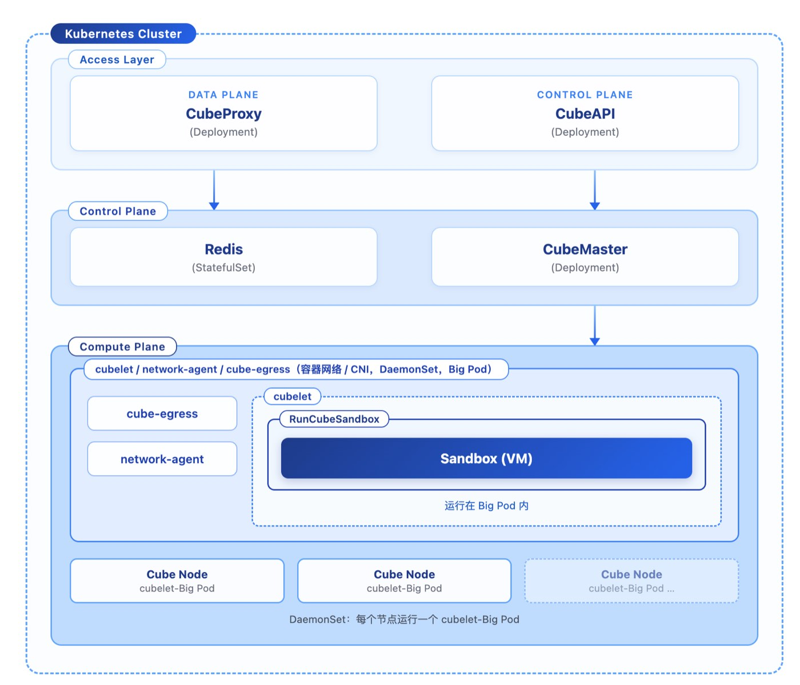

# Running CubeSandbox on Kubernetes: Deployment and Production Practice

By｜openFuyao Community Agent Sandbox SIG · Wang Wentao (Full-Stack Engineer) / Li Aihua (Maintainer)

**Editor's note:** openFuyao is an open-source community for general-purpose and intelligent computing cluster software innovation, with its compute infrastructure built entirely on K8s. The openFuyao Agent Sandbox SIG team moved the whole CubeSandbox stack into a K8s cluster, aiming to let sandbox compute nodes be elastically scaled and rolling-upgraded by K8s like ordinary workloads.

Through technical innovation at multiple layers, the openFuyao Agent Sandbox SIG team achieved the division of labor: K8s manages the nodes, CubeSandbox manages the sandboxes. This practice record covers the technical thinking and evolution behind that division — which responsibilities go to K8s, which stay with CubeSandbox, and where the boundary is drawn — as well as how the network, process, feature-semantics, and scheduling problems encountered along the way were solved one by one.

## 1. Why Run CubeSandbox in K8s

In CubeSandbox's early open-source days, the default deployment form was direct installation on physical machines.

- Control plane (CubeAPI / CubeMaster / CubeProxy / CoreDNS), with Docker Compose managing MySQL/Redis
- Compute plane (Cubelet / network-agent / CubeShim / CubeHypervisor) running as host processes.

This form works out of the box on bare-metal single machines or multi-machine clusters, but presents many inconveniences for large-scale cluster management.

Our compute infrastructure is built entirely on K8s. The delivery, scheduling, elastic scaling, monitoring, and configuration of all workloads are handled by K8s. If CubeSandbox kept its physical-machine deployment form, we would have to maintain two operational systems on the same platform: releases going through K8s CI/CD on one track and systemd on another; monitoring hooking into Prometheus + K8s events on one track and host agents on the other; certificates, configs, and secrets rotating through separate channels. The mental cost is doubled.

The final form we expect: sandbox compute nodes should be elastically scaled and rolling-upgraded by K8s like ordinary workloads.

So we **packaged CubeSandbox's control plane, data plane, and compute plane as standard K8s workloads — letting K8s take on infrastructure orchestration, and letting CubeSandbox itself take on sandbox lifecycle management and scheduling**. The overall architecture does not intrude on K8s's core control plane — APIServer, Scheduler, etcd — and uses only standard K8s primitives (CRD / Operator / native scheduling), introducing no extra orchestration components. We previously submitted the proposal to the community as [discussion #636 (CubeSandbox on Kubernetes)](https://github.com/TencentCloud/CubeSandbox/discussions/636).

## 2. The K8s-Based Deployment Architecture

How Cube Sandbox components map onto K8s:

| Cube Component | K8s Form | Key Points |
|:--|:--|:--|
| **Cubelet + network-agent + cube-egress + CubeShim + CubeHypervisor** | **DaemonSet (Big Pod)** | Privileged pod; mounts hostPath /dev/kvm, /data/cubelet, etc.; sandboxes run inside the Big Pod |
| **CubeAPI / CubeMaster / CubeProxy** | **Deployment** | Deployment + Service; CubeMaster mounts a PV to store template data, preventing template loss on restart |
| **MySQL / Redis** | StatefulSet | Stores business data |
| **CoreDNS** | Reuse cluster CoreDNS | Configure domain forwarding for cube.app |

*Table 1: The K8s-based CubeSandbox deployment plan*

The keys to this architecture:

- A Cube Node runs as one Big Pod containing the key business components cubelet / network-agent / cube-egress;
- It is responsible for node-side sandbox create/destroy/snapshot/network isolation;
- The Big Pod runs with container networking; sandbox network information is managed via eBPF and can follow the Big Pod's lifecycle, avoiding polluting the host network and reducing conflicts with other eBPF network managers.

*Figure 1: K8s cluster deployment architecture overview*

As shown, there are three layers — Access Layer / Control Plane / Compute Plane. Every Cube Node contains a cubelet Big Pod, and each Big Pod embeds Sandbox VMs.

## 3. Two Key Problems: Discovery and Solutions

### 3.1 Same-Node Access to Sandbox Network Fails

Soon after running the compute plane in Big Pods, we hit the most memorable problem — we documented it as [issue #443](https://github.com/TencentCloud/CubeSandbox/issues/443).

The symptoms:

- Host node IP 76.0.121.10
- Big Pod IP hosting cubelet/network-agent: 172.24.205.149
- Sandbox IP 192.168.0.3, listening on port 49999; eBPF maps the port to Pod port 20007.

We organized the symptoms into 5 controlled scenarios:

| Scenario | Source | Target | Result |
|:--|:--|:--|:--|
| 1 | Another host node 76.0.145.47 | 76.0.121.10:20007/health | ✅ OK (a route was added on 76.0.121.10 forwarding :20007 to pod 172.24.205.149:20007) |
| 2 | The cubelet pod itself (172.24.205.149) | 192.168.0.3:49999/health (direct to sandbox IP) | ✅ OK |
| 3 | Another pod on the same node, cubeproxy (172.27.205.177) | 172.24.205.149:20007/health | ❌ No response |
| 4 | Same-node host 76.0.121.10 | 172.24.205.149:20007/health | ❌ No response |
| 5 | The cubelet pod itself (172.24.205.149) | 172.24.205.149:20007/health (via podIP:mapped port) | ❌ No response |

One-sentence summary of the symptom: **whenever traffic comes from the same node and targets the "mapped port" (podIP:20007), it always fails; cross-node traffic (via the node's physical IP + route) or direct-to-sandbox-IP works fine.**

Our main analysis steps from symptom to root cause:

1. **Rule out the application layer first**: scenario 2 works, proving the sandbox service itself, the TAP device, and the from_cube direction are all fine; the problem lies only in the inbound path "outside → mapped port."
2. **Distinguish "cross-node" from "same-node"**: scenario 1 works while 3/4/5 fail; the difference is whether inbound traffic traverses the **node's physical NIC**. This is the most critical point.
3. **Capture packets with nettrace**: analysis showed cross-node traffic forwarding normally in the kernel, while same-node traffic forwarding showed only traffic entering the sandbox — nothing coming back out.
4. **Capture on the TAP device**: attach tcpdump directly to the sandbox's TAP device (named like z192.168.0.3): cross-node SYNs arrive normally; same-node traffic shows cksum problems.
5. **Inspect the BPF programs and maps**: bpftool prog show / bpftool map show confirm whether from_world and remote_port_mapping are properly attached, and whether the mapping table has the entry 20007 → (tapIfindex, 49999).
6. **Modify the BPF program to add key logs**: add bpf_printk logging to the eBPF program for packet-drop analysis; the logs are printed to /sys/kernel/debug/tracing/trace_pipe.

The packet captures and eBPF logs point to the same root cause: same-node traffic hits a cksum error when passing through the TAP device and gets dropped by the kernel. Code walkthrough confirmed the reason — when forwarding same-node traffic, eBPF doesn't fill in the pseudo-header fields, so checksum validation inevitably fails.

Behind this bug lies a history of upstream evolution in virtio-net TAP offload capabilities:

- v0.2.0 ([PR #110](https://github.com/TencentCloud/CubeSandbox/pull/110)): the hypervisor advertised TSO/UFO/CSUM offload capabilities to the guest; CHECKSUM_PARTIAL packets from the guest, once they hit a host NIC that doesn't support the corresponding offloads, would cause network anomalies and even affect other traffic on the same host. Upstream therefore **disabled** virtio-net TAP TSO/UFO/CSUM in v0.2.0.
- v0.4.0 ([PR #505](https://github.com/TencentCloud/CubeSandbox/pull/505) + [PR #469](https://github.com/TencentCloud/CubeSandbox/pull/469)): upstream replaced bpf_csum_diff() with bpf_{l3,l4}_csum_replace and enabled TX checksum/TSO offload on TAP, **re-enabling** TSO/UFO/CSUM (rolling back #110), while dropping the disableGRO() requirement on host NICs. Among the issues linked from PR #469 is our issue #443.

issue #443 was filed during the v0.3.x era, when TAP offload was still disabled; once the compute plane moved into pods and offload semantics became inconsistent between TAP and pod veth, the L4 checksum of same-node inbound packets fell into a "nobody fills it in" state — manifesting as "checksum validation fails." Our issue drove the diagnosis, and the final fix was completed upstream in v0.4.0.

### 3.2 The cubelet Orphan Process and PID 1 in Pods

The symptom of this problem: after cubelet moved into K8s, the pod couldn't run properly. Code analysis showed the problem lay in cubelet's own process model — it was designed assuming it runs directly under host systemd; inside a pod, that assumption conflicts with PID 1.

First, look at cubelet's startup flow (main.go:62-106):

The flow shows: process A establishes an independent mount namespace, forks process B which inherits that namespace; process B in turn kills process A to release resources and avoid process A holding the ns fd, which would affect later cleanup. In the end, only process B (the orphan) survives, running the actual cubelet service.

The core contradiction: process B kills its own parent (process A) and becomes an orphan. Orphans in a container get reparented to PID 1. If PID 1 mishandles this (say PID 1 is process A itself, or PID 1 exits), the container crashes.

Our solution is to give the pod a real init process: tini as PID 1, an entrypoint script that starts cubelet in the background, plus a preStop hook and a pidfile.

Three roles, each handling one thing: tini reaps orphans and forwards signals; bash monitors process B and triggers cleanup; pidfile + preStop ensure external signals can precisely target the real cubelet process. With this combination, cubelet's original "process A builds the ns, process B inherits and kills its parent" model is fully preserved — we didn't change a single line of cubelet code for K8s.

## 4. Four Semantic Shifts When Moving Cube Features into K8s

Currently, in the K8s scenario, we use many of Cube Sandbox's key features, such as template distribution, snapshot, pause-resume, host-mount, egress control, network policies, the E2B interface, and ARM adaptation.

During usage, we also ran into problems; our experience is summarized below:

**1. Template distribution.** CubeMaster's templatecenter distributes template artifacts to compute nodes. In K8s, template artifacts land on the compute-plane pods' local disks, so "distribution" is really point-to-point transfer from CubeMaster to each node's cubelet. If CubeMaster or a compute-plane Big Pod restarts, the templates stored on it are lost.

Our experience: for CubeMaster losing its stored templates on restart, mount a PV; when upgrading the compute-plane cubelet Big Pod, store templates on a persistent hostPath for local templates — make it follow the node, not the pod.

**2. host-mount.** This feature has a semantic trap: the "host" CubeSandbox refers to is the machine cubelet runs on, but under K8s, cubelet itself runs inside a pod. To let real node directories penetrate into sandboxes, the compute-plane pod must have both hostPath volumes and privileged mode.

**3. Network policies block K8s CIDRs by default.** CubeVS has an "always deny" CIDR list: 10.0.0.0/8, 172.16.0.0/12, 192.168.0.0/16, 127.0.0.0/8, 169.254.0.0/16. **And K8s pod/cluster IPs almost all fall inside these ranges** — meaning by default, sandboxes cannot reach K8s internal services (in-cluster APIs, databases, other pods). If a sandbox needs to access these ranges, you must explicitly allow the target service CIDR via allow_out, or you'll hit "sandbox can't reach in-cluster services."

**4. network-agent startup failure.** After deploying on K8s Pods, network-agent needs to get a MAC address from the NIC at startup. Inside a pod container, it can't get the MAC, so startup fails. Our solution is a three-step approach — **"resolve the gateway IP from the routing table → exact-match by IP in the neighbor table → lenient state filtering"** — which first solved the wrong-gateway-MAC problem in K8s Pod environments, and, by also accepting states like NUD_STALE/NUD_PROBE, tolerates the window where the ARP cache hasn't refreshed yet at pod startup.

## 5. The Conflict Between K8s Scheduling and CubeSandbox's Own Scheduling

After all features were ported, one last "scheduler conflict" problem remained.

**CubeSandbox has its own scheduler** (CubeMaster, with default overcommit_ratio of 3× CPU / 2× memory); K8s also has its scheduler. The two must have clearly divided responsibilities, or problems arise:

- **K8s schedules at the granularity of "compute-plane pods"**: deciding which node runs cubelet, with how much CPU/memory request/limit.
- **Cube schedules at the granularity of "individual sandboxes"**: deciding which cubelet (node) a sandbox lands on.

The conflict point is resource limits. If K8s caps the compute-plane pod's resources.limits too tightly, Cube's overcommit (CPU 3×) gets backfired by K8s cgroups — Cube believes it can still fit more sandboxes, while the K8s cgroup has already throttled the pod's CPU.

Our avoidance plan: keep K8s scheduling at the "node level," and leave sandbox bin-packing to CubeSandbox. We recommend giving compute-plane pods generous or no CPU/memory limits, leaving bin-packing to Cube's own overcommit and physical-load protection; K8s only decides whether this node runs cubelet.

## 6. Advice for Other Teams

After practice and exploration in real scenarios, we have three pieces of advice for other teams landing CubeSandbox on K8s:

1. **Keep K8s scheduling at the "node level" and leave sandbox bin-packing to CubeSandbox**: don't cap compute-plane pod resource limits too tightly, or CubeSandbox's overcommit will be backfired by K8s cgroups.
2. **Network policies should explicitly allow in-cluster service CIDRs as needed**: CubeVS denies 10.0.0.0/8, 172.16.0.0/12, and 192.168.0.0/16 by default; for sandboxes to reach K8s internal services, allow_out must be set explicitly.
3. **Give compute-plane and control-plane pods dedicated taints + system-node-critical priority**: avoid sandbox avalanches caused by K8s eviction.

Cube Sandbox has provided a native K8s deployment plan since v0.6.0, whose deployment model is similar to our self-built one — a fast switch to the community-native capability is possible, and building on the community model lets us evolve faster with the ecosystem's power. Based on our business scenarios, we also hope the community continues building five capabilities: 1) cross-machine pause and resume (already supported in v0.7.0, preview); 2) cross-machine Snapshot sandbox startup (already supported in v0.7.0, preview); 3) control-plane/data-plane isolation with zero-downtime data-plane upgrades; 4) higher sandbox creation throughput; 5) compatibility with more eBPF-based CNI plugins (such as cilium / calico).
