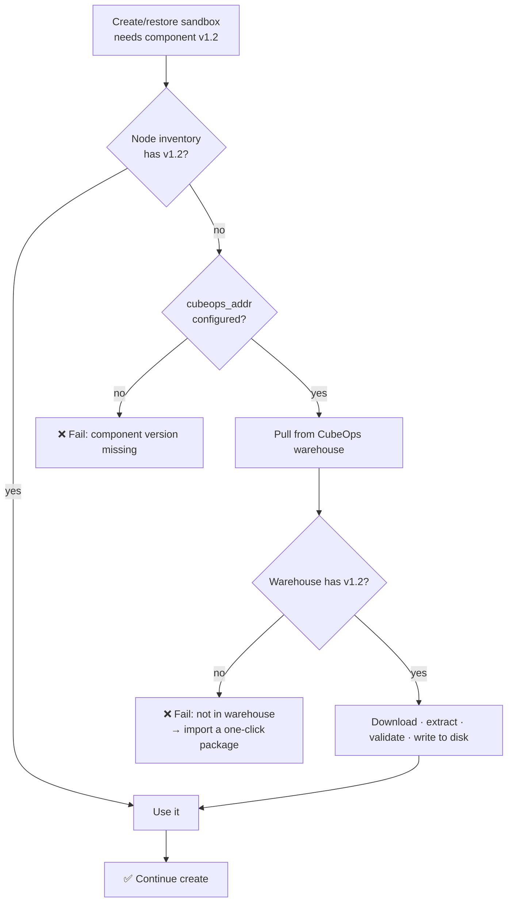

# Component multi-version

A node keeps several versions of each component on disk at the same time. When creating or restoring a sandbox, the version bound to the template is used; if it is not on the node, a copy is pulled from the CubeOps warehouse. This way, after a node upgrades its components to a new version, sandboxes built with the old version still restore and old templates still schedule — the upgrade does not affect them.

The four components:

| Component | What it is |
| --- | --- |
| `cube-shim` | Container runtime shim and cube-runtime |
| `cube-image` | Guest root filesystem image |
| `cube-agent` | The agent inside the guest |
| `cube-kernel-scf` | Guest kernel |

## Background: why multi-version

Previously a node had only one copy of each component (the current toolbox). When the upgrader bumped it, the version changed. The trouble is that a template is built against a specific version. Say the node bumps `cube-image` from v1 to v2:

- A sandbox built with v1, on restore, can only pick up v2 — the version does not match, restore fails outright.
- An old template replica built on v1 is flagged incompatible (STALE) and cannot be scheduled.
- To recover, the old template has to be rebuilt and the node re-provisioned with components. New and old templates could not coexist on one node.

With multi-version: every version is kept. v1 is still on the node, so an old sandbox restores against v1 and an old template still schedules — upgrading to v2 does not affect it at all. New and old templates coexist on one node; upgrades are no longer disruptive.

## How it runs

When creating or restoring a sandbox, the flow is:



There are two places on the node disk:

```
/usr/local/services/cubetoolbox            ← current toolbox: updated in place by the upgrader, what the node uses now
/data/cubelet/root/component_versions/     ← versioned inventory: versions side by side, read at create/restore
├── cube-image/
│   ├── v1.0/
│   └── v1.2/
└── cube-kernel-scf/
    └── v1.2/
```

In one line: **a missing version is never papered over with the current toolbox — it is fetched from the warehouse.** So the current toolbox can be upgraded freely, and replicas already bound to an old version are unaffected — this is stable restore. New templates bind all four components; only history replicas migrated from an older version may have bound only two, and they do not get stable restore.

## What operators do

**1. Import versions into the warehouse** (so nodes have something to download)

On the warehouse home page, click “Import one-click package.” Only `cube-sandbox-one-click-<tag>-{amd64,arm64}.tar.gz` is accepted, imported per package — one package writes several components at once; there is no “import only one.” Three sources: GitHub Release (defaults to allowing only `TencentCloud/CubeSandbox`), CNB Release (`CubeSandbox/CubeSandbox`), local tar.gz upload (max 8 GB). After submitting you do not have to watch it — go to the “Jobs” page for progress.

**2. Stage large versions onto nodes ahead of time** (don’t let the first create stall on download)

On a component’s detail page, click “Preinstall”, tick the nodes that don’t have it, and it downloads in the background. **Preinstall does not create a sandbox** — it only stages the version onto the node. `cube-image` and the kernel are large (GB-scale); downloading on first create will most likely exceed the 10-minute timeout — stage them first and it is fine.

**3. Read coverage, clean up old versions** (manage disk)

Each card on the warehouse home has a “coverage” line: green = everything covered, yellow = N nodes missing, grey “coverage unavailable” = CubeOps cannot list nodes. **The inventory is not cleaned up automatically**; old versions accumulate. Before deleting, check the “bound version” column of the compat matrix and confirm no replica still binds that version. Deleting a version in the console removes only the central copy in the warehouse — the node-local copy is not removed.

## Troubleshooting

| Error | What it means | What to do |
| --- | --- | --- |
| `component version missing on node` | `cubeops_addr` is not set and the node lacks the version | Set `cubeops_addr` on the node and open access to CubeOps `:3010` |
| `component version not in warehouse` | Address is set but the warehouse has no such version | Import the matching one-click package in the console |
| Download failed (network error / 5xx / validation failed) | Warehouse has it but download or extract failed | Check the Cubelet logs `mod=warehouse`; retry or re-import |
| Coverage shows “unavailable” | CubeOps cannot list nodes | Check CubeOps node management / Redis and the node-agent heartbeat |
| Import job failed | The jobs page shows the reason: out of allow-list, missing token, source unreachable, bad package format | Fix per the message |

## Deployment

“Fetch on miss” depends on two network paths:

- **Node → CubeOps**: ask for the download URL and report the local version inventory. If this path is down, the node falls back to “only versions already on the node” — a miss fails outright.
- **Node → object storage**: where the data actually comes from. Component packages live in a dedicated `cube-ops` bucket.

All three deployments configure the CubeOps address for nodes automatically (override with `CUBE_OPS_ADDR`); what differs is the object-storage side:

| Deployment | Works out of the box | Object storage |
| --- | --- | --- |
| **Helm** | ✅ | The chart's bundled MinIO by default. To use your own S3/COS, set `cubeOps.s3` and make sure nodes can reach that address. |
| **One-click install** | ✅ | Reuses the volume MinIO/S3 connection automatically, in a dedicated `cube-ops` bucket. Nothing to configure. |
| **Terraform TKE** | ❌ | The default stack ships no object storage, so the warehouse is disabled. Wire COS (or another S3) into cube-ops to enable it — the address must be reachable from the compute CVMs, which sit outside the cluster. |

Warehouse data lives in S3, not on a CubeOps local disk, so CubeOps can run multiple replicas. The availability ceiling is the chart's bundled MinIO — a single instance; for HA, use external S3/COS.

## Configuration

| Setting | Default | Notes |
| --- | --- | --- |
| `cubeops_addr` (Cubelet) | empty | CubeOps address, e.g. `http://<ops>:3010`. **Empty = no download**; a missing version fails outright. |
| `cubeops_timeout` (Cubelet) | `10m` | Total time budget for pulling one version; leave headroom for GB-scale components. |
| `CUBE_OPS_STORE_BACKEND` (CubeOps) | `s3` | `fs` = local/PVC warehouse; CubeOps serves signed download URLs. |
| `CUBE_OPS_STORE_FS_PUBLIC_URL` (CubeOps) | empty | Node-reachable CubeOps URL when `backend=fs`. |
| `CUBE_OPS_S3_ENDPOINT` (CubeOps) | empty | Object-storage address. **Empty = warehouse disabled**; CubeOps itself still runs. |
| `CUBE_OPS_S3_NODE_ENDPOINT` (CubeOps) | same as endpoint | The address nodes download from; set it only when nodes cannot reach the default one (e.g. they sit outside the cluster). |
| `CUBE_OPS_S3_BUCKET` (CubeOps) | `cube-ops` | Dedicated bucket for warehouse blobs. |
| `CUBE_OPS_WAREHOUSE_WORK_DIR` (CubeOps) | `/var/tmp/cubeops-warehouse` | Local scratch space for unpacking imports; give it room for the largest package. |
| `CUBE_OPS_WAREHOUSE_GITHUB_REPOS` / `CNB_REPOS` | see allow-lists above | Import allow-lists, comma-separated, overridable. |
| `CUBE_OPS_WAREHOUSE_*_TOKEN` | empty | Only needed for private releases. |

Two things to know about the `cube-ops` bucket:

- **Permissions**: give CubeOps read/write access to the bucket, including multipart uploads. The minimum IAM action list is in the CubeOps README.
- **Credentials**: nodes hold no S3 credentials (unlike s3fs volumes) — they only get a short-lived signed download URL. That also means anyone who can write the bucket can change the binaries nodes execute; treat the AK/SK as a trust boundary.

> `/internal/warehouse/*` called by nodes carries no JWT (identified only by `X-Cube-Node-ID`, same treatment as `/internal/meta`) — **expose it only to the compute-node network, never to the public.** Admin APIs go through `/opsapi` and carry JWT.
