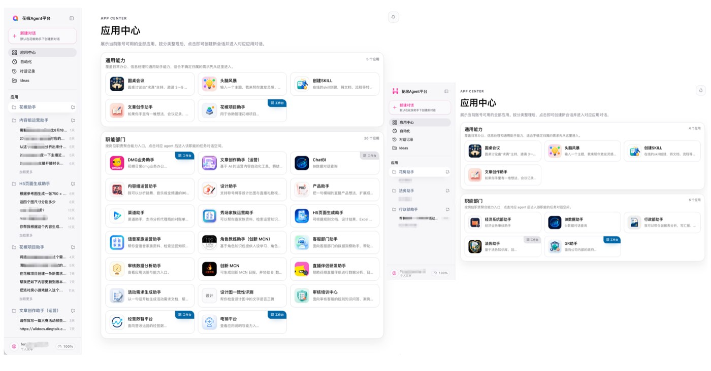
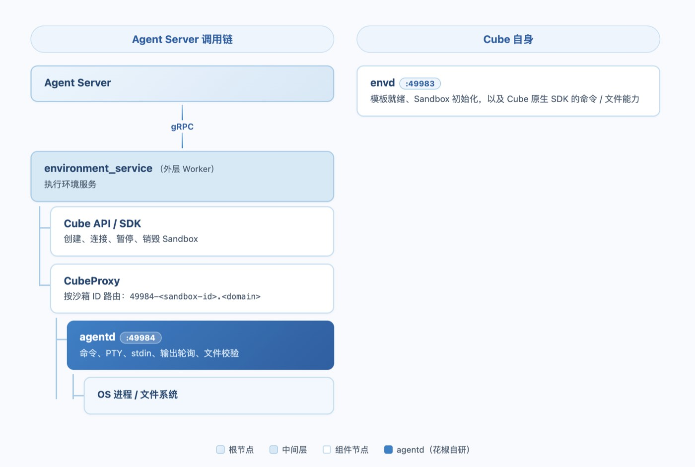

# 沙箱是选项，不是标配：花椒 Agent 平台的架构思考与 Cube 实践

作者｜花椒直播基础架构部负责人 · 王成龙；花椒直播 CTO · 封冰清

**编者按｜** 大部分团队接入 Agent 沙箱时，思考顺序是"我们需要隔离，所以上沙箱"。花椒团队的顺序是先把 Agent 平台设计成一层可配置的执行环境抽象，沙箱只是这个抽象层里的选项，由每个 Agent 根据自己的隔离需求决定要不要用。

这篇实践记录的是这套思考是如何落地的，包括从组织级的隔离决策，到贡献 Go SDK、定位并修复一个 host-mount 场景下的快照恢复 bug，再到在 CubeSandbox 之上重新定义了一套终端协议。

## 一、沙箱是执行环境的一个选项

花椒直播是花房集团旗下的产品。我们企业 Agent 平台最早在花椒直播业务侧完成从 0 到 1 的落地验证；后续基于这套沉淀的底层能力，为花房集团中台搭建了一套独立部署的实例。

- 花椒 Agent 主要服务花椒直播内部的设计、产品、技术、运营、客服、审核等部门，应用中心目前上线了 25 个入口，包括 DMG 业务助手、ChatBI、内容运营助手、设计助手、产品助手、H5 页面生成助手、客服部门助手、审核数据分析助手、经营数智平台和电销平台等；此外还有一个独立的 C 端产品。
- 花房 Agent 服务花房集团中台，已经在经济系统、数据、行政、法务、GR（政府关系）5 个部门落地，包括 BI 数据助手、行政部助手、法务工作台和 GR 工作台等应用。

两套部署基于同一套 Agent Runtime，分别服务花椒直播的业务部门和花房集团的中台部门，合计已经落地约 30 个不同的 Agent 应用。花椒的实践完成了平台和业务应用从 0 到 1 的验证，花房的实践则进一步验证了同一套底层能力可以跨组织独立部署和复用。

*图 1：花椒 Agent、花房 Agent 平台截图*

搭建 Agent 平台时，我们先确定了一条边界：平台内部不放任何业务相关的代码。所有 Agent 的能力都通过后台配置生成。这样一套架构可以完全复用给任意场景的 Agent，而不用适配每个新业务而重新开发、重新"造轮子"。这就好比：Agent 平台相当于操作系统，而 Agent 则是跑在操作系统上的应用，Skills 相当于各类开发框架和 SDK。

这套架构中最关键的一层抽象叫执行环境——大模型要执行命令时，具体在哪执行，就是执行环境要回答的问题。一个 Agent 可以配置一个或多个执行环境，也支持个人私有执行环境的动态注册和移除。执行环境的操作系统可以是 Windows、Linux 或 macOS，部署形态可以是裸金属、普通云服务器，也可以是 Kubernetes。每种执行环境都会启动一个守护进程，负责和 Agent 平台通信。**CubeSandbox 是我们接进执行环境服务的一种沙箱方案，目前暂时只部署在普通云服务器上，后续还会扩展到 K8s 场景**。但不管执行环境本身是什么性质，都可以在其上选择用沙箱。

什么场景才要上沙箱，我们没有定统一规则，而是按 Agent 的定位来判断。判断的核心只有一个：这台执行环境上的资源，需不需要在多个用户之间物理隔离。如果 Agent 管理的是一台专属机器，工作内容只有单一主体在消费，用不用沙箱没有区别；同一台执行环境一旦要服务多个用户，每个人的工作状态必须彼此独立，我们一般就会选择沙箱。换句话说，隔离决策不在平台层统一，而是随 Agent 的定位落到具体执行环境上。

在 Agent 之间，我们按"资源要不要物理隔开"的标准决定要不要用沙箱；在组织之间，我们把同一个标准用在了更高的层级，例如，花椒 Agent 和花房 Agent 采用了两套完全独立的实例部署，平台服务、账号权限、业务数据、应用资产、执行环境和 CubeSandbox 实例分别管理，不共享控制面。因为，我们现阶段更看重不同组织之间清晰、可审计的安全边界，这个优先级高于共享控制面能带来的资源复用效率。

## 二、Cube Sandbox 的选型与落地

选型之前，我们用的是最原始的方案：单服务器目录隔离。其间遇到了一系列问题：缺乏隔离能力，用户 A 理论上可以通过 Agent 操作到用户 B 的文件。我们评估过其他几类方案，逐一被否：Docker 启动慢、隔离不彻底、性能低；传统虚拟机成本高，资源分配也不灵活。MicroVM 级的方案层面，我们调研、测试对比了启动速度后，发现 CubeSandbox 最快，特性和性能也符合预期，尤其是强隔离这一条，经过实验确认能满足需求，就应用了下来。

选型确定之后，遇到的第一个实际问题是：用户数据放在哪。沙箱本身是可回收的，但用户的工作状态必须跨沙箱保留下来。我们最初的做法是挂载外部磁盘，用户数据需要持久化，不能因为云服务器故障就丢失，所以放在一块数据盘上，而不是系统盘。后来考虑高可用性，我们发现普通数据盘做不到同时挂载到多台云服务器，于是升级成 NFS 方案——用户的持久化数据全部写到 NFS 目录，云服务器故障时立即启动新机器挂载同一个 NFS 继续服务，损失的只是运行中的进程。这套方案接进 CubeSandbox 靠的是 host-mount 机制：部署在云服务器上的执行环境守护进程，把不同目录映射到沙箱内部，沙箱内部无法做权限逃逸，守护进程只关注最小粒度的会话，一个会话对应一个沙箱。

落地过程中，我们遇到的不只是"怎么把 CubeSandbox 用起来"的应用层问题，还有几次必须直接动 CubeSandbox 本身代码的情况。我们从 CubeSandbox 第一个发布版本起就在用，当时官方还没有 Go SDK，我们自己写了一版对齐 Python SDK 的能力，提交到了官方仓库（[PR #254](https://github.com/TencentCloud/CubeSandbox/pull/254)）"Add Go SDK"，一次性提交生命周期管理、命令执行、文件读取、proxy transport 等完整能力，共 15 个文件、新增 3288 行代码。合并当天，官方代码审查发现 `Sandbox.Close()` 会意外关闭多个沙箱共享的 HTTP 连接池，我们随即提交（[PR #322](https://github.com/TencentCloud/CubeSandbox/pull/322)）修复。

另一次更深的问题出现在休眠唤醒场景。挂载了磁盘的沙箱在休眠和唤醒时存在 bug，我们定位到根因是 CubeSandbox 给 host-mount 场景打快照时，没有为 virtio-fs 准备好迁移所需的元数据，根 inode 因此丢失了迁移状态，恢复时报错 InvalidVirtioFsState。我们随后又提交了（[PR #341](https://github.com/TencentCloud/CubeSandbox/pull/341)）和（[PR #354](https://github.com/TencentCloud/CubeSandbox/pull/354)）进行修复和后续加固，但 PR #354 测试之后自己关掉了，原因是测完之后不确定这个改动是否完美。我们目前的做法是直接销毁沙箱再重建，绕开还没解决的部分。

*图 2：花房集团 Agent 平台管理界面*

目前，CubeSandbox 已经在我们生产环境运行了 3 个多月。支撑了花椒和花房两个实例的大约 30 个 Agent 应用，日均 token 消耗约 8300 万。

## 三、agentd：在 CubeSandbox 之上重新定义一套终端协议

为了丰富对外提供的能力的需求，我们在 Cube Sandbox 之上加了一层自研的终端协议——agentd，用来和 Agent 平台的执行环境服务对接，与 Cube 模版里自带的 envd 并存分工。它在制作沙箱模版时会默认启动。

### 3.1 agentd 的定位与自研背景

envd 本身不缺执行命令、文件读写或 PTY 这些基础能力，CubeSandbox 官方文档把它定义为 Sandbox 的原生数据面，模板探针、初始化，以及 SDK 的 command/file API 都依赖它，命令、文件、文件系统和 PTY 相关的请求都路由到 envd 的 49983 端口。

但我们研发的 agentd，不是对 envd 的简单补缺，而是平台为 exec_command / write_stdin 定义并掌握语义的**专用终端会话数据面。**

**之所以开发 agentd，原因有三层**：第一，我们需要一套自己定义、能够长期独立演进的终端协议，而不是把 runtime 的会话模型直接绑定在 Cube 或 E2B 的外部 API 语义上；第二，我们需要一个能直接验证"挂载后的技能和工件是否真的在 Sandbox 内可见"的接口（StatFiles），并且需要一套自己可控的 bearer-token 认证边界；第三，早期实现时我们遇到过一个具体的缺陷——Cube API 没有把创建 Sandbox 时设置的环境变量传递到 CubeMaster，导致我们原计划给每个 Sandbox 注入一个随机 AGENTD_TOKEN 的方案无法成立，后来改成模板和 Worker 共享一个固定 token。更准确的说法是：agentd 补的是我们自己需要的契约、可控性和故障语义，不是在补 envd 缺失的通用执行能力。

| 维度 | envd | agentd |
|:--|:--|:--|
| 端口 | 49983 | 49984 |
| 所属 | CubeSandbox 原生组件 | 本仓库模板内的服务 |
| Cube 模板/初始化 | 必需 | 不承担 |
| Cube 原生 SDK 命令/文件 API | 使用 | 不使用 |
| 本平台 exec_command / write_stdin | 当前不走它 | 当前唯一执行数据面 |
| 生命周期操作 | 不负责 | 不负责 |
| Sandbox 创建/暂停/恢复/销毁 | Cube API / Cube SDK 负责，二者都不是该层 | 同左 |

### 3.2 agentd 的运行机制

作为模板主命令启动（PID 为 1），监听 0.0.0.0:49984，它提供的是一组很窄的 HTTP API：

- `GET /healthz`：存活、版本、活跃会话数；
- `POST /v1/sessions`：启动 shell 命令；
- `GET /v1/sessions/{id}`：从指定 chunk 游标开始长轮询输出；
- `POST /v1/sessions/{id}/stdin`：写标准输入；
- `POST /v1/sessions/{id}/resize`：调整 PTY；
- `DELETE /v1/sessions/{id}`：关闭会话；
- 文件读取、批量 stat、从 URL 拉取并写入文件。

### 3.3 一次命令执行的关键路径

1. 外层 Worker 根据 thread 找到或创建专属的 Sandbox，准备好 workspace、上传文件、技能和持久目录挂载；
2. Worker 通过 CubeProxy 拼出 `http(s)://49984-<sandbox-id>.<domain>` 这个地址访问 agentd，而不是调用 Cube SDK 原生的 command API；
3. agentd 为这次执行创建独立进程组，TTY 命令走 PTY，非 TTY 命令分别捕获 stdout 和 stderr；输出写进一个带单调 chunk_id、有容量上限的内存 ring buffer，外层 Worker 用游标轮询增量，不会重复上报同一段输出；
4. 短命令直接返回终态，长命令返回 session_id，Worker 把它映射成我们自己的 write_stdin 会话，在后台持续轮询、上报输出和退出结果；
5. timeout_ms 会取消进程，会话结束后保留短暂 TTL 再回收，只有 CubeSandbox 断连或 agentd 持续不健康时，Worker 才会把这个会话判定为 session_lost。

这套机制真正解决的问题，不是"能不能跑 shell 命令"，而是把我们自己需要的一整套终端语义固定下来——PTY、标准输入、chunk 游标、输出截断、明确的 timeout/exit 状态、会话丢失判定，以及这些状态和平台自身持久化任务状态之间的一致映射。

*图 3：CubeSandbox 路径中 agentd 的运行方式*

envd 和 agentd 目前是并存分工的关系：envd 跑在 49983 端口，是 CubeSandbox 的原生组件，Cube 模板初始化必需，Cube 原生 SDK 的命令和文件 API 走它；agentd 跑在 49984 端口，是我们模板里自带的服务，不承担模板初始化，也不使用 Cube 原生 SDK，是我们当前唯一的执行数据面。两者都不负责沙箱的创建、暂停、恢复、销毁这类生命周期操作，这部分始终由 Cube API 和 SDK 负责。部署脚本会把两个端口同时暴露，写进模板状态：envd_port=49983、agentd_port=49984。agentd 是模板里的主命令，但这不等于它接管了 Cube 的基础设施职责——Cube 仍然需要原生的 envd 来完成模板就绪和初始化，我们只是在一个已经创建、且网络可达的 Sandbox 上，把自己的终端和文件协议直接代理到 agentd 上。用我们自己的话来说，agentd 抹平的是执行环境类型——不管底层是 CubeSandbox 还是别的沙箱方案，业务侧对接的都是同一套 agentd 协议，不需要感知底下具体跑的是什么。

## 四、一次资源认知的纠偏

资源分配上，我们走过一段完整的认知纠偏。最初对沙箱的理解不足，以为资源是按实际用量动态分配的，不知道还有预分配资源这层机制，所以没有对沙箱做任何规格配置。

内存不够之后，云服务器先触发了监控告警，我们紧急扩容了云服务器。当时没有细究这次内存不足具体是 OOM、卡死还是变慢，先把问题压下去，事后才回头看了一下 CubeSandbox 的默认配置，发现这套默认值本身还算合理，就没再调整。

基于这次经历，我们现在的资源规划分成了两层：测试环境用一台小规格云服务器，线上环境用一台中高规格服务器，同时做了沙箱的闲置回收机制，结合云服务器自身的监控告警去动态调整服务器规格。我们给其他在使用沙箱的团队一个参考建议是：明确沙箱的定位，把它当成一个高性能、强隔离的虚拟机去用，而不要预设它会像某种弹性资源池那样按实际使用自动伸缩。

## 写在最后

回过头看，这套实践里最值得记录的，是我们的两层思考：

- 一层是"执行环境是可配置的，沙箱只是其中一个选项"，这层思考把隔离决策下放到了每个 Agent 自己身上；
- 另一层是"CubeSandbox 提供的原生协议不必是我们唯一依赖的协议"，agentd 的存在证明了我们愿意在 CubeSandbox 的原生数据面之上，再补一层自己完全掌控的终端语义。

这两层思考共同指向同一个结论——沙箱是被我们反复验证、按需选用的一个组件，不是被默认套用的标配。
