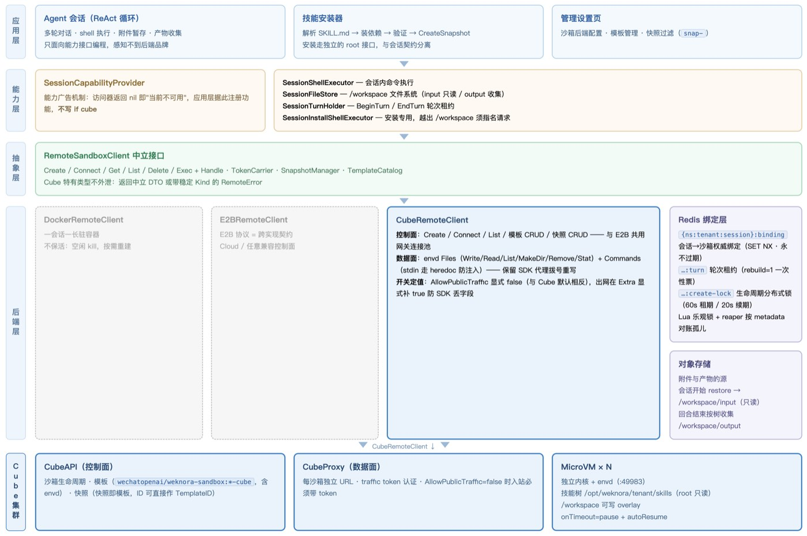

# WeKnora 基于 CubeSandbox 的 Agent 持久化运行环境建设

作者｜腾讯技术专家、WeKnora 项目 Maintainer · 陈洋、赵海龙

**编者按｜** WeKnora 是腾讯开源的企业级 LLM 知识平台，自 2025 年 8 月开源以来热度持续攀升，目前已收获 24.4k stars。它把企业的文档资产转化为 RAG 问答、ReAct 智能体和自维护 Wiki。

其沙箱层同时支持了 Cube Sandbox、E2B、Docker 三种后端，其中 Cube Sandbox 已经跑通了会话绑定、技能快照、暂停恢复、模板管理和网络策略的完整链路。这篇文章记录了 WeKnora 对 Cube Sandbox 的设计与建设过程，也回答一个更根本的问题：沙箱在 Agent 平台里，到底该扮演什么角色。

## 一、Cube Sandbox 在 WeKnora 里的应用全景

WeKnora 最新发布的 v0.8.0，核心特性是技能沙箱运行时：会话级常驻的 Docker/E2B/Cube 沙箱后端，按空间配置网络策略。沙箱在 WeKnora 里，并不是跑一次性命令的附属执行件，而是 Agent 技能的运行环境。

Docker/E2B（含 E2B Cloud 和任意 E2B 兼容控制面）/Cube 三种后端并列。应用层不按品牌分支，走同一套 RemoteSandboxClient + 会话绑定。部署方按隔离强度和运维形态选。在 CubeSandbox 这条线上，WeKnora 的用法主要包括以下七项：

| 用法 | Cube 机制 | 解决什么 |
|:--|:--|:--|
| **会话级持久沙箱** | Create + metadata 会话绑定 | 一个会话绑定一个沙箱，上一轮装的包、创建的文件、跑起来的服务，下一轮还在 |
| **技能快照化** | CreateSnapshot（快照 ID 即 TemplateID） | 装好技能的沙箱打成快照，新会话直接从快照创建，技能秒级就位 |
| **暂停恢复** | onTimeout=pause + autoResume | 空闲自动暂停，下一轮 Connect 自动恢复，内存态不丢 |
| **会话文件系统** | envd Files API | 附件、产物、跨 tool call 的工作区，全部收进 /workspace |
| **命令执行** | Commands API + stdin 注入 | Agent 在会话内跑脚本，执行结果可追踪 |
| **模板管理** | 模板 CRUD + 独立镜像变体 | weknora-sandbox:\*-cube 镜像，携带 envd 数据面 |
| **网络策略** | 出站/入站双开关 + L7 规则 | 按空间控制沙箱能不能出网、能不能被公网访问 |

WeKnora 沙箱层中的三种后端，可以实现上层业务代码一行不改的条件下互换。支撑这个约束的是两层设计：

- 第一层是中立接口 RemoteSandboxClient：Create、Connect、Get、List、Delete、Exec 六个生命周期方法，加上文件、快照、模板、入站令牌四个辅助接口。Cube 特有的类型、错误码和 HTTP 语义全部被翻译成中立的 DTO 和带稳定 Kind 的 RemoteError，不向外泄漏一行。
- 第二层是能力广告：应用层不写 if cube，而是在运行时查询能力访问器：会话内命令执行、会话文件系统、轮次标记、安装命令。访问器返回 nil，就表示当前配置下这个能力不可用，应用层据此决定注册哪些功能。

*图 1：WeKnora x Cube Sandbox 集成架构示意图*

CubeRemoteClient 承载了 Cube 后端的全部适配代码，收敛在单个文件中；它同时实现四个接口，所有调用划分为两个平面：

| 平面 | 调用内容 | 传输路径 |
|:--|:--|:--|
| 控制面 | Create / Connect / List / 模板 CRUD / 快照 CRUD | 经共享网关连接池，与 E2B 后端复用同一个 transport |
| 数据面（envd） | Files 操作（Write/Read/List/MakeDir/Remove/Stat）+ Commands 执行 | 保留 SDK 的代理拨号重写（ProxyNodeIP/Port/Scheme），经独立 transport 包裹 |

目前，WeKnora 主要以三种形态接入 Cube：裸金属、PVM，K8s（目前还在 preview 阶段）。

## 二、沙箱角色的转变：从"跑完即毁"到"持久化运行环境"

用法全景里的这些能力设计和架构设计，是在经历了几次实际问题之后才逐步演化成型的。

最初的后端是 Docker，实现是每次 `docker run --rm`，跑完即毁。它暴露出三个问题：1）会话状态缺失，上一轮装的包下一轮就丢失了；2）shell 执行、附件暂存、产物收集这些能力在能力矩阵里注册不上；3）超时杀的是客户端进程，容器还在后台跑。后来改成"一会话一长驻容器"，行为才和 Cube/E2B 对齐。

但 Docker 的天花板也很明显，它实现不了我们的三个底层需求：跨主机调度、内核级隔离、内存态快照。对运行模型生成代码的场景，共享内核的隔离边界也不够。这三样缺失，把我们的选型推向了远程沙箱服务。

接入远程沙箱，WeKnora 选择走 E2B 协议。但是，转折发生在技能持久化这个需求出现的时候。技能环境要构建、要打成镜像、要管理版本，这些是控制面能力。E2B 协议同样覆盖模板构建与网络控制，两者的差异在于粒度：对运行中的沙箱直接打快照、快照 ID 作为模板使用、allowOut/denyOut 延伸至 L7 规则的出站控制。这些正是技能镜像方案所需要的能力，Cube 的控制面 API 恰好一一对应。这也是为什么 WeKnora 在 E2B 适配器之外，单独维护了一个 Cube 适配器。

WeKnora 技能持久化的最初设计是"一 skill 一卷"，即每个技能一个 volume 挂载进沙箱。因为 E2B Volumes 当时还处在 private beta 阶段，我们的首发改用了 Cube，并在动手实现前把整个方案从卷挂载换成了快照。不过这次被迫的改道，后来被证明是一条更好的路。

演进到这里，沙箱的角色已经发生了根本变化。**它不再是"拿沙箱跑个命令"的执行容器，而是 Agent 技能的持久化运行环境**，技能预装在里面，会话在里面发生，文件也"长"在里面。

## 三、技能持久化：把快照做成发行版

技能安装的成本模型，决定了它不能摊到每个会话上。

装一个技能要做什么？解析 SKILL.md、装系统包和 Python/Node 依赖、跑安装验证。这本身就是一次长达数分钟的 agent 对话。如果用户发起会话时才现场装，太难等；每个会话各装一份，又太浪费。因此，技能环境必须冻结成不可变的产物，会话直接从这份产物启动。

那为什么选择快照而不是 volume？两者代表的是两条相反的模型。volume 是共享可写的，适合数据集；技能环境要的是"已验证、不可变"：装完后 skills 目录归 root 所有、只读，会话里临时 `pip install` 只能落到 /workspace 的 overlay，不能污染镜像。而且对依赖系统包的技能，volume 方式难以支持，还存在装好的技能被 agent 改掉的风险。

这条路能走通，依托的是 Cube 快照的四个特性。

- **快照 ID 可以直接当 CreateOptions 的 TemplateID**：会话侧根本不知道"技能"两个字，它只是换了一张模板。
- **可以对运行中的沙箱打快照**：安装过程就是普通的 exec 加文件写入，不需要另搭一套镜像构建流水线。
- XFS reflink/CoW 让"底层模板 + 一层已装依赖"的存储密度和增量成本合理。
- 快照与沙箱保活共享同一套生命周期语义，配套齐全。

完整的安装链路是这样的：从基础模板创建沙箱 → 安装器执行安装 → 校验通过 → ledger 先落库、再调 CreateSnapshot → 记录 SnapshotID。之后所有新会话用快照 ID 代替模板 ID 创建，技能秒级就位。

快照的"所有权"由指纹机制守门。指纹是 SHA-256(provider + APIKey + APIURL)——标识快照所在的提供商账户。安装路径、快照生效判断、配置解析三方从相同输入计算指纹，保证判定一致。凭据轮换后指纹不匹配，旧快照静默失效，会话自动回退基础模板，而不是拿着一个已经不存在的镜像 ID 去启动。指纹为空时，安装流程会直接拒绝记录快照，没有 owner 的指针会在会话启动时被丢弃。

选择快照方案同样需要付出代价，主要是两条。Cube 把快照和普通模板放在同一个列表接口里返回，WeKnora 的设置页必须把 snap- 前缀和快照列表减掉，否则管理员会把技能镜像当成底模选上去。另外，技能装进快照后，随安装次数累积，镜像会慢慢膨胀。

## 四、会话持久化：保活与 /workspace

Agent 会话是分钟到小时级的，中间夹着思考、等用户、等检索。如果 TTL 一到就 kill，用户下一句话就要经历一次冷启动，/workspace 里的中间文件、overlay 包、未交的产物，全部消失。

所以会话沙箱创建时就是 onTimeout=pause + autoResume：空闲把 MicroVM 冻住，省计算、保内存态，下一轮 Connect 自动唤醒。对用户来说，体感就是：对话还在，环境还在。

Docker 后端的处理方式是一个有意思的对比。Docker 的 pause 内存还占着宿主机，冻住等于不回收。所以 Docker 后端空闲是 kill，由绑定层在下次使用时重建，它对齐的语义是"没有了就当可重建"，不是保活。同一个抽象接口下，不同后端各自选择语义，这正是中立接口层的价值。

环境的另一半是文件系统。envd 的读写如果只给安装器用，Agent 在会话里就是个"瞎子"。WeKnora 把 Files API 收成会话文件系统，解决了四件事：

- **附件**：对象存储才是源，会话开始时 restore 到 /workspace/input（只读约定），技能通过环境变量拿到这个目录；
- **产物**：脚本写 /workspace/output，回合结束按同一棵树收集下载，不经过模型"读文件再贴聊天"，也不占用上下文；
- **模型写文件**：生成的脚本直接落盘，不必塞进 shell 命令的 heredoc；
- **跨 tool call 的工作区**：同一会话多次执行看到同一棵树。这才是「持久化运行环境」对模型可见的部分。

技能镜像是只读的"发行版"，/workspace 是可写的"这一轮电脑"。两套路径、两套权限，文件 API 是后者的正式入口。

## 五、身份持久化：Redis 绑定层与孤儿回收

Cube 的 TTL 加 AutoPause 管的是 MicroVM 自己的寿命：空闲了就 pause，下次 Connect 就 resume。它不知道 WeKnora 的会话、租户、副本、技能代际。这些应用语义，全压在 Redis 绑定层上：

| Cube 有的 | Redis 补的 |
|:--|:--|
| 沙箱 ID、TTL、pause | **会话 → 沙箱的权威绑定**（多副本 WeKnora 必须共享，内存绑定只适合单进程开发） |
| 单次 Create | **生命周期锁**：create/recover/replace/delete 跨进程串行，避免同一会话起两台 VM |
| metadata（我们会打上 tenant/session/config） | 绑定丢失后靠 metadata **认领**；认领不到才新建。TTL/pause 救不回"绑定写丢了" |
| 沙箱自己过期 | 绑定**永不过期**（SET NX，TTL=0）。会话还在、沙箱被 pause 了，绑定必须在，才能 resume 而不是再买一台 |
| 无"镜像已换"概念 | StaleAt 标记 + 轮次租约（见下） |
| pause 后仍占快照存储和钱 | 孤儿回收：绑定被覆盖或 Redis 丢了之后，paused 沙箱会占据磁盘。Cube 不会按「WeKnora 还认不认」去删 |

这层设计要面对的最典型问题是计费。会话沙箱用 onTimeout=pause，绑定一旦丢失，Cube 侧就是一台 paused 的 VM，会一直占用存储空间。所以必须有一层 reaper：按 tenant metadata 定期对账，把未绑定的实例（包括 paused 的）删掉。

这两层的分工因此非常清晰：**Cube 把沙箱管活；Redis 把"这台沙箱属于哪个会话、能不能拆、该不该换镜像"管住。**

## 六、轮次租约：管理员装技能，用户正在对话

持久环境带来了一个独有的冲突：管理员在装技能，用户正在对话，意味着他们在抢同一台 VM。

这个冲突的具体场景是这样：Agent 一轮对话要多次解析沙箱：暂存附件、若干次命令执行、跑技能脚本、收产物——全都假定 /workspace 和进程还在。而技能安装常常就发生在对话中间——第一次工具调用之后管理员装完了，第二次工具调用就把 VM 拆了，这轮的草稿、已装进 overlay 的包、在跑的 exec 全部消失。模型侧的表现就是"刚才还在的文件没了。"

不拆也不行。技能安装成功后，如果已有会话不做标记，用户刚装的技能在当前对话里永远看不见——指针切换只影响新建沙箱。

WeKnora 的解法是把"声明"和"动手"分开：

- **StaleAt 是声明**：镜像已经换了，但不动手。
- **BeginTurn 时 rebuild=1**：**本轮第一次 resolve 允许拆掉重建；ConsumeTurnRebuild 立刻置零。** 同轮后续 resolve 即使仍是 stale，也继续用当前沙箱。
- 没有租约（没有 AgentQA 在飞）时，stale 仍然立即重建——后台任务、空闲会话没必要拖。
- Redis 读租约失败时当有一轮在飞，不拆。

"只重建一次"防的是另一种情况：一轮之内多次解析、中间又来一次安装，反复拆 VM。票消费掉之后，本轮不再重建。进程崩溃泄漏的轮次标记由 30 分钟 TTL 兜底过期，此时重建 stale 镜像是预期行为。

## 七、预埋的、踩出来的，和给后来者的清单

在上述这些设计里，有一部分是架构设计阶段预先埋好的：

- 后端无关的 RemoteSandboxClient，能力用 capability 广告，不用 if cube。
- 会话级沙箱 + Redis 绑定 + 生命周期锁。
- 租户可控 URL 的 SSRF：保存时校验 + 拨号时再校验（防 DNS rebinding）；即便允许私网，也拦 link-local / 云 metadata。
- 技能装进快照、会话从快照启动；ledger 先写再 CreateSnapshot。
- 脚本和非 root user（uid 1000）执行；安装才走 root 的独立接口。
- 工作目录锁在 /workspace，技能树在 /opt/weknora/tenant/skills，快照前清 scratch。

预埋设计里，网络策略的处理值得单独说明。Cube 的网络控制有两个开关，分别管两个正交的维度：allowInternetAccess 管出站——沙箱能不能主动出公网，curl/pip 通不通由它叠加 allowOut/denyOut/L7 规则决定；allowPublicTraffic 管入站——沙箱的公网 URL 是否公开可达，关掉后所有入站必须带 traffic token，否则 403。WeKnora 在创建每个沙箱时把两个开关都显式定值，防的是默认漂移——配置里省略不写，服务端就回落模板默认，模板一变，线上行为跟着变。其中 allowPublicTraffic 显式 true 是刚需：WeKnora 的文件、执行、终端全走 CubeProxy 数据面 URL，关掉它，自家访问先被 403 挡住。现状是出站默认全放行——这是有意识的起点选择，技能安装要拉包，先保证通；细粒度的按空间/会话出站白名单还在收紧的路上。

另一部分，则是运行过程中我们踩过坑，沉淀出来的经验：

- Cube 模板必须带 envd，否则 :49983/health 探活 connection refused——于是有独立的 -cube 镜像变体。
- 快照混进模板列表，设置页要滤掉 snap- 前缀。
- ListSnapshots 分页 token 循环重复会失败，技能孤儿清理曾因此卡死。
- 通用 E2B 数据面兼容：envd 要 Basic auth、要补 X-User-ID 头，上传要 multipart 而 SDK 发裸 octet-stream——E2B Cloud 宽容，其它实现直接 401/500。
- 设置页保存曾把 SkillImage 指针冲掉，技能「列表里在、会话里没有」——更新接口现在不允许客户端碰快照字段和端点。
- 一轮中途拆 VM 毁 /workspace——轮次租约。
- 命名配置字段级继承曾悄悄拨到 127.0.0.1——改为命名配置自包含，不继承部署基线的 endpoint。
- 命令黑名单连 `pip install` 的恢复建议一起拦——改成技能装完即只读、内核拒写，失败后再提示走 overlay。

对于同样在做 Agent 平台的团队，我们建议先验证以下八件事（按"技能持久化"这条路径，而不是"能 exec 就行"）：

1. 快照 ID 能否直接当模板创建新沙箱、快照是否混在模板列表里；
2. 对运行中实例打快照，打完原沙箱还能不能用、pause 期间打快照稳不稳；
3. pause 加 Connect 自动 resume，文件系统和内存还在不在、paused 实例是否仍计费、怎么 List 到；
4. Create 时的 metadata 能否按租户/会话 List 回来——没有这条，多副本和崩溃恢复只能靠自己的绑定库碰运气；
5. 出网双开关是否真如文档所说正交生效、私网里 DNS 是否可用；
6. 数据面 envd 契约——Basic auth、multipart 上传、非 root 账号，不要只测官方网关，它更宽容；
7. 镜像里有没有 envd，没有会在健康检查上直接失败；
8. 分页、删除幂等、名字回显——技能镜像是账单资源，进程死在"已创建、未落库"窗口时，必须能按名字认领或按 List 对账。

在架构层面，WeKnora 目前仍然缺少的能力包括：Create 时挂 volume（Cube 的 CreateOptions 还没有 volume-mount 字段，共享数据集、热更新大文件目前没有这条路）；快照与模板分目录（混在一起污染"选底模"的产品体验，也增加误删风险）；pause/超时的应用层回调（现在只能自己扫 List，TTL 到了 WeKnora 不会被通知，孤儿只能周期性对账）；以及按会话身份的一等公民——Cube 管 VM，不管"这是哪个 session 的"，绑定、租约、stale、孤儿全在应用侧。如果控制面能原生认 metadata 所有权、按策略回收未认领实例，Redis 这层可以瘦很多。

**WeKnora 项目地址：**<https://github.com/Tencent/WeKnora>
