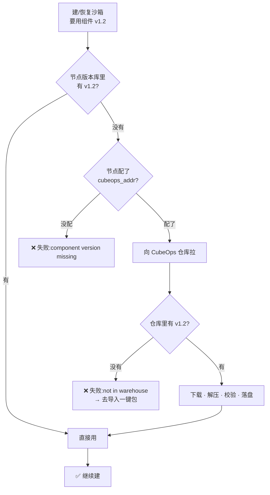

# 组件多版本

节点上同时留着好几个版本的组件。建沙箱、恢复沙箱都按模板绑定的版本来取；本地没有，就去 CubeOps 仓库拉一份下来。这样节点把组件升到新版后，用老版本建的沙箱照样能恢复、老模板照样能调度，不会被升级连累。

四个组件：

| 组件 | 是什么 |
| --- | --- |
| `cube-shim` | 容器运行时 shim 和 cube-runtime |
| `cube-image` | 客户机根文件系统镜像 |
| `cube-agent` | 客户机里的 agent |
| `cube-kernel-scf` | 客户机内核 |

## 背景：为什么要多版本

以前节点上只有一份组件（当前工具箱），升级器一升，版本就跟着变。麻烦在于：模板是按特定版本建的。举例说，节点把 `cube-image` 从 v1 升到 v2：

- 用 v1 建好的沙箱，恢复时只能取到 v2，版本对不上，恢复直接失败。
- 用 v1 的老模板副本被判成不兼容（STALE），没法调度。
- 想救回来，只能把老模板重做、重新给节点装组件。新老模板没法在一台节点上并存。

有了多版本：每个版本各留一份。v1 还在节点上存着，老沙箱恢复照样取 v1，老模板照样调度，节点升到 v2 一点都不影响它。新老模板能在一台节点上并存，升级不再伤筋动骨。

## 它怎么跑

建沙箱、恢复沙箱的时候，走这么一条路：



节点磁盘上有两块地方：

```
/usr/local/services/cubetoolbox            ← 当前工具箱:升级器就地更新,节点现在用的就是它
/data/cubelet/root/component_versions/     ← 版本库:多版本并排,建/恢复从这里取
├── cube-image/
│   ├── v1.0/
│   └── v1.2/
└── cube-kernel-scf/
    └── v1.2/
```

一句话：**缺版本不会拿当前工具箱凑合，而是去仓库下**。所以当前工具箱随便升，都不影响已经绑定老版本的副本——这就是稳定恢复（stable restore）。新模板会把四个组件的版本都绑上；只有从老版本迁过来的历史副本可能只绑了两件，不享受稳定恢复。

## 运维该干啥

**1. 把版本导进仓库**（节点才有东西可下）

仓库首页点「导入一键包」。只认 `cube-sandbox-one-click-<tag>-{amd64,arm64}.tar.gz`，按包导——一个包里几个组件一次写进去，没有「只导某一个」的说法。来源三种：GitHub Release（默认只让下 `TencentCloud/CubeSandbox`）、CNB Release（`CubeSandbox/CubeSandbox`）、本地传 tar.gz（最大 8 GB）。提交完不用盯着，去「任务」页看进度。

**2. 把大版本提前装到节点**（别让第一次建沙箱卡在下载）

进组件详情页，点「预装」，勾上没装的节点，后台就会下。**预装不建沙箱**，纯粹是把版本先装过去。`cube-image`、内核这些体积大（GB 级），第一次建的时候才去下，十有八九会超过 10 分钟超时——提前装好就没事。

**3. 看对照、清旧版本**（管磁盘）

仓库首页每张卡片有个「对照」：绿的 = 都齐了，黄的 = 有 N 个节点缺，灰的「对照不可用」= CubeOps 列不出节点。**版本库不会自动清**，老版本越攒越多；删之前先看兼容矩阵的「已绑版本」列，确认没有副本还绑着这个版本。在控制台删某版本，只删仓库里的中心副本，节点上那份不删。

## 出问题怎么查

| 报错 | 啥意思 | 怎么办 |
| --- | --- | --- |
| `component version missing on node` | 没配 `cubeops_addr`，节点上又没这版本 | 给节点配上 `cubeops_addr`，打通到 CubeOps `:3010` |
| `component version not in warehouse` | 地址配了，但仓库里压根没这版本 | 去控制台导入对应的一键包 |
| 下载失败（网络错 / 5xx / 校验不过） | 仓库有，但下载或解压出了错 | 翻 Cubelet 日志 `mod=warehouse`，重试或重新导 |
| 对照栏「对照不可用」 | CubeOps 列不出节点 | 查 CubeOps 节点管理 / Redis 和 node-agent 心跳 |
| 导入任务失败 | 任务页会写原因：白名单外、没 token、源连不上、包格式不对 | 照着改 |

## 部署

「缺了自动拉」依赖两条网络：

- **节点 → CubeOps**：领下载地址、上报本地版本清单。这条路不通，节点就退回「只用已有的版本」，缺了直接失败。
- **节点 → 对象存储**：数据真正下载的地方，组件包统一放在独立的 `cube-ops` 桶。

CubeOps 的地址三种部署方式都会自动配给节点（需要时用 `CUBE_OPS_ADDR` 覆盖），差别只在对象存储这一侧：

| 部署方式 | 开箱即用 | 对象存储 |
| --- | --- | --- |
| **Helm** | ✅ | 默认用 chart 内置 MinIO。要换自己的 S3/COS 就配 `cubeOps.s3`，并确认节点能访问那个地址。 |
| **一键安装** | ✅ | 自动复用 Volume 的 MinIO/S3 连接，独立 `cube-ops` 桶，无需配置。 |
| **Terraform TKE** | ❌ | 默认栈没有对象存储，仓库处于禁用状态；给 cube-ops 接上 COS（或其他 S3）后才可用，地址必须是集群外 CVM 能访问的。 |

仓库数据都在 S3、不占 CubeOps 本地盘，所以 CubeOps 可以跑多副本；可用性的短板在 chart 内置 MinIO——单实例，要 HA 就换外部 S3/COS。

## 配置

| 配置 | 默认 | 说明 |
| --- | --- | --- |
| `cubeops_addr`（Cubelet） | 空 | CubeOps 地址，比如 `http://<ops>:3010`。**留空 = 不下**，缺版本直接失败。 |
| `cubeops_timeout`（Cubelet） | `10m` | 拉一个版本的总时限；GB 级组件要留够余量。 |
| `CUBE_OPS_STORE_BACKEND`（CubeOps） | `s3` | `fs` = 本地/PVC 仓库，由 CubeOps 签发下载 URL。 |
| `CUBE_OPS_STORE_FS_PUBLIC_URL`（CubeOps） | 空 | `backend=fs` 时节点可达的 CubeOps 地址。 |
| `CUBE_OPS_S3_ENDPOINT`（CubeOps） | 空 | 对象存储地址。**留空 = 仓库禁用**，CubeOps 本身照常启动。 |
| `CUBE_OPS_S3_NODE_ENDPOINT`（CubeOps） | 同 endpoint | 节点下载用的地址；节点访问不到默认地址（比如在集群外）时才需要设。 |
| `CUBE_OPS_S3_BUCKET`（CubeOps） | `cube-ops` | 仓库专用的桶。 |
| `CUBE_OPS_WAREHOUSE_WORK_DIR`（CubeOps） | `/var/tmp/cubeops-warehouse` | 导入时解包用的本地临时空间，要放得下最大的包。 |
| `CUBE_OPS_WAREHOUSE_GITHUB_REPOS` / `CNB_REPOS` | 见上面白名单 | 导入白名单，逗号分隔，可覆盖。 |
| `CUBE_OPS_WAREHOUSE_*_TOKEN` | 空 | 私有 release 才用得上。 |

关于 `cube-ops` 桶，有两件事要知道：

- **权限**：给 CubeOps 这个桶的读写权限（含分块上传），最小 IAM 清单见 CubeOps README。
- **凭据**：节点不持有 S3 凭据（这点和 s3fs 卷不同），拿到的只是短时效的签名下载 URL。也因此，能写这个桶的人就能改节点执行的二进制——把 AK/SK 当作信任域边界。

> 节点调的 `/internal/warehouse/*` 不带 JWT（就靠 `X-Cube-Node-ID` 认，跟 `/internal/meta` 一个待遇），**只开给计算节点网络，别挂公网**。管理 API 走 `/opsapi`，带 JWT。
